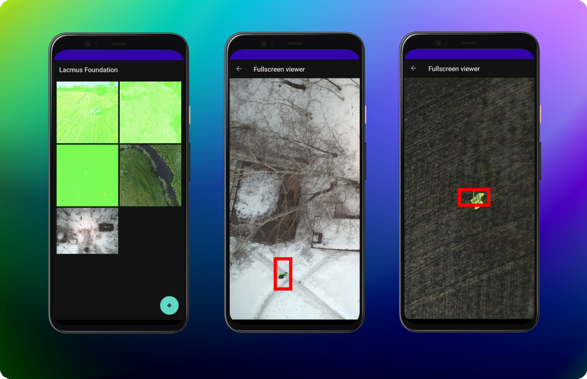

# Lacmus Android Application 

Find missing people in photos on your android device. 

## Installation

todo

## Usage

1. Click (+) button in the right bottom of screen to open images. 
2. Select images, where you want to detect peoples. 
3. Click open, and you will see grid of selected images on main screen of application. Objects detection algorithm starts in background automatically. 
4. Image frames have three colours: 
- $${\color{red}Red}$$ - processed, found people. 
- $${\color{green}Green}$$ - processed, not found people. 
- $${\color{gray}Gray}$$ - processing in progress.
5. Click on image, and you can see in in fullsrceen, zoom and swap. 
6. To exit application just click back button few times. 

